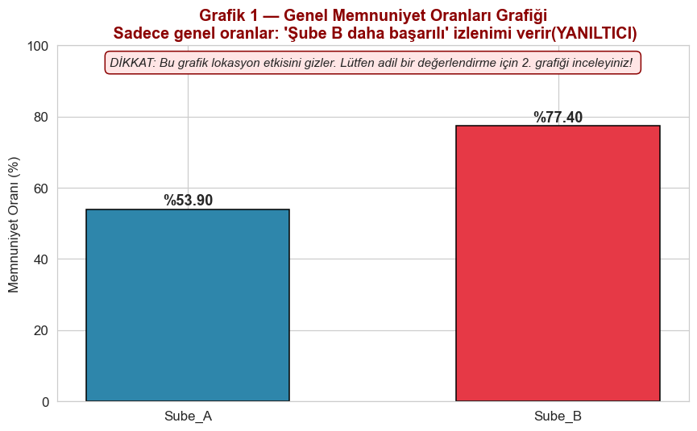
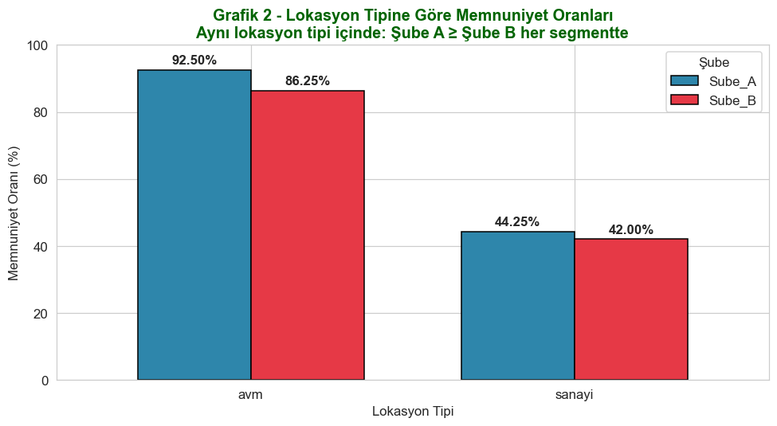
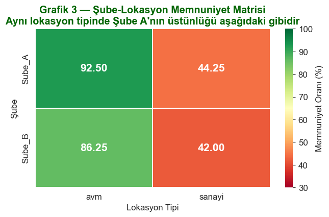
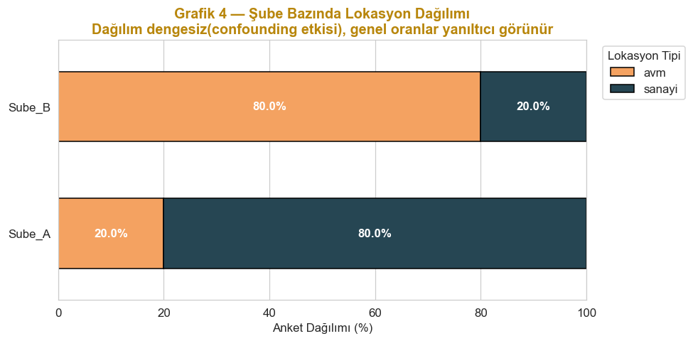

# Restoran Şube Performans Analizi

### Simpson Paradoksu ve Karıştırıcı Değişken Tespiti

Bir restoran zincirinde iki şube yöneticisinin performansı müşteri memnuniyeti üzerinden karşılaştırılıyor. Ham oranlar yanıltıcı bir İK kararına yol açacak kadar çarpık görünüyor. Bu çalışma, SQL, pandas ve istatistiksel testlerle bu yanılgının nedenini adım adım gösteriyor.

**Teknolojiler:** Python, pandas, NumPy, Matplotlib, Seaborn, Jupyter, SQL (PostgreSQL uyumlu)

## Proje Özeti

Yönetim ham veriye bakıp şu sonuca vardı:

> "Şube B %77.4 memnuniyetle Şube A'nın (%53.9) belirgin üzerindedir. Şube B yöneticisi ödüllendirilmeli, Şube A için yönetici değişikliği önerilir."

Veri bunu desteklemiyor. Lokasyon tipi sabit tutulduğunda Şube A her segmentte daha iyi sonuç veriyor.

## Temel Bulgular


|            | Ham Veri  | AVM Lokasyonu | Sanayi Lokasyonu |
| ---------- | --------- | ------------- | ---------------- |
| **Şube A** | %53.9     | **%92.5**     | **%44.3**        |
| **Şube B** | **%77.4** | %86.3         | %42.0            |


Ham oranda Şube B önde görünürken her lokasyon tipinde Şube A önde. Bu, klasik bir Simpson Paradoksu örneğidir.

## Neden Böyle Oldu


|            | AVM anketi | Sanayi anketi |
| ---------- | ---------- | ------------- |
| **Şube A** | %20 (200)  | %80 (800)     |
| **Şube B** | %80 (800)  | %20 (200)     |


Şube A anketlerinin %80'i, doğal olarak daha düşük memnuniyet üreten sanayi lokasyonlarından geliyor. Şube B anketlerinin %80'i ise daha yüksek memnuniyetin görüldüğü AVM lokasyonlarından geliyor. Lokasyon tipi yöneticiden bağımsız olarak memnuniyeti yaklaşık 44 puan değiştiriyor (AVM %87.5, sanayi %43.8). Anketlerin şubelere zıt yönde dengesiz dağılması bir seçilim yanlılığı (selection bias) oluşturuyor ve ham karşılaştırmayı baştan adaletsiz hale getiriyor.

## İstatistiksel Test Sonuçları

İki oranlı z testi kullanıldı. Fark, Şube A oranından Şube B oranı çıkarılarak hesaplandı.


| Karşılaştırma    | z değeri | p değeri | Yorum                         |
| ---------------- | -------- | -------- | ----------------------------- |
| Ham veri         | -11.07   | < 0.001  | Şube B anlamlı önde görünüyor |
| AVM lokasyonu    | 2.39     | 0.017    | Şube A anlamlı önde           |
| Sanayi lokasyonu | 0.57     | 0.566    | Anlamlı fark yok              |


Lokasyon kontrol edildiğinde Şube B'nin görünen üstünlüğü ortadan kalkıyor.

## Görselleştirmeler


| Grafik 1: Yanıltıcı genel oranlar                                | Grafik 2: Lokasyona göre oranlar                                     |
| ---------------------------------------------------------------- | -------------------------------------------------------------------- |
|  |  |


| Grafik 3: Şube ve lokasyon matrisi                              | Grafik 4: Lokasyon dağılımı                                      |
| --------------------------------------------------------------- | ---------------------------------------------------------------- |
|  |  |


Defterlerin ürettiği ek grafikler (güven aralıkları, ısı haritası ve eğim grafiği dahil) `images/notebook_outputs` klasöründe yer alıyor.

## Proje Yapısı

```
.
├── README.md
├── data/
│   └── restaurant_branch_success.csv
├── sql/
│   ├── 01_overall_satisfaction.sql
│   └── 02_satisfaction_by_location.sql
├── notebooks/
│   ├── 01_satisfaction_analysis.ipynb
│   └── 02_visualization.ipynb
├── images/
│   ├── report/
│   └── notebook_outputs/
└── reports/
    └── Restaurant_Analysis.pdf
```


## Veri Seti

`data/restaurant_branch_success.csv` dosyası 2000 anket kaydı içeriyor (her şube için 1000).


| Sütun               | Açıklama                              |
| ------------------- | ------------------------------------- |
| `ticket_id`         | Anket kaydının benzersiz numarası     |
| `model`             | Şube (Sube_A veya Sube_B)             |
| `lokasyon_tipi`     | Lokasyon tipi (avm veya sanayi)       |
| `musteri_memnun`    | Müşteri memnuniyeti (evet veya hayır) |
| `siparis_suresi_dk` | Sipariş süresi, dakika                |
| `masa_sayisi`       | Şubedeki masa sayısı                  |


## Nasıl Çalıştırılır

1. Gerekli paketleri kur: `pip install pandas numpy matplotlib seaborn jupyter`
2. Jupyter'i başlat ve `notebooks` klasöründeki defterleri sırayla çalıştır. Defterler veriyi `../data` yolundan okur ve grafikleri `../images/notebook_outputs` klasörüne kaydeder.
3. SQL sorguları için CSV dosyasını `restoran_memnuniyet` adlı bir tabloya yükle, ardından `sql` klasöründeki dosyaları çalıştır.

Analizin adım adım anlatımı `reports/Restaurant_Analysis.pdf` dosyasında bulunuyor.

## Kazanımlar

1. Ham oran tek başına yanıltır, karşılaştırmayı her zaman segmentlere ayırarak yap.
2. Karıştırıcı değişken tespiti analizin en kritik adımlarından biridir.
3. Simpson Paradoksu gerçek İK kararlarında ciddi hatalara yol açabilir.
4. Adil bir karşılaştırma için eşit koşullar gerekir, örneğin rastgele ya da tabakalı yönlendirme.


## English Summary

Two restaurant branch managers were compared on customer satisfaction. On raw data, Branch B looked clearly better (77.4% vs 53.9%), which led management to suggest rewarding its manager and replacing Branch A's. Once location type is held constant, Branch A leads in both mall (92.5% vs 86.3%, p = 0.017) and industrial locations (44.3% vs 42.0%, not significant). The reversal happens because 80% of Branch A surveys come from low satisfaction industrial sites, while 80% of Branch B surveys come from high satisfaction malls. This is a textbook Simpson's paradox caused by a confounding variable. The analysis uses SQL, pandas, two proportion z tests and Matplotlib and Seaborn visualizations.